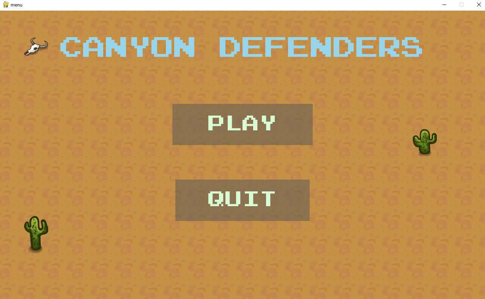
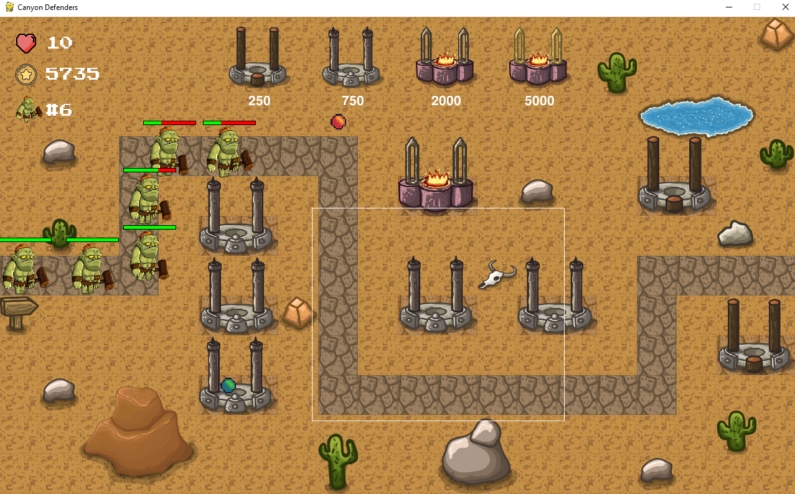

# Canyon Defenders
Canyon Defenders is a tower defense game where you must defend your canyon from waves of enemies. You have 15 waves to survive, and you can use four different types of towers to help you. You can drag and drop towers to place them, and you can drag and drop new towers to upgrade existing towers

## Screenshot



## Playground Pygame Folder
This folder contains a basic test game for learning pygame. I followed this [tutorial](https://realpython.com/pygame-a-primer/) to learn basics of pygame.

##  Development

Canyon Defenders was developed using PyGame and map is created with [tiled](https://www.mapeditor.org/). You can access assets for free from this [youtube video](https://www.youtube.com/watch?v=C4_iRLlPNFc) and this [website](https://craftpix.net/).

## How to Play

- Drag and drop towers onto the map to place them.
- Drag and drop new towers onto existing towers to upgrade them.
- Use your towers to defeat all the enemies in each wave.
- Survive all 15 waves to win the game!

## Towers

- There are 4 diffrent tower types in this game.
- Each of them has it's own damage, range, shooting speed and shooting rate.
- You can hover over a tower to see it's range.

## Game Status

- `Health:` You can see the remaining health before losing the game. Each enemy that passes equals with one health loss.
- `Money:` You can see your current balance for buying and upgrading towers.
- `Wave Number:` You can see the current wave number.

## Run project locally

Clone the project

```bash
  git clone https://github.com/mustafa-mun/canyon-defenders
```

Go to the project directory

```bash
  cd canyon-defenders
```

Install PyGame

```bash
  python3 -m pip install -U pygame --user
```

Start game

```bash
  python3 game.py
```

